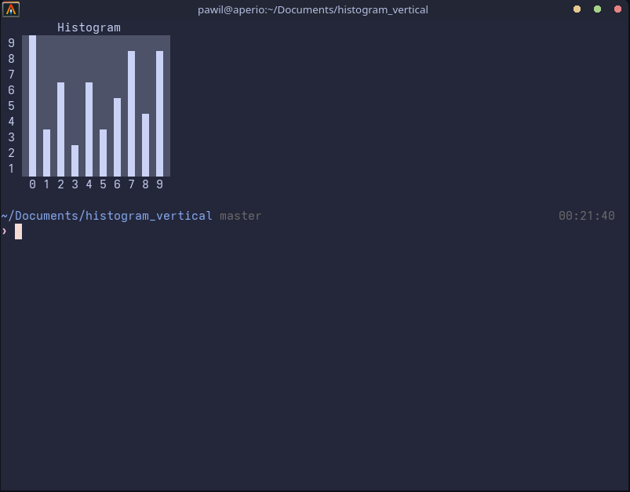

### *My change to the task: Instead of counting words, the program counts the number of digits in the standard input (`getchar()`).

Example histogram for string `714277481936498065930009700274586872967216020942995074`:

